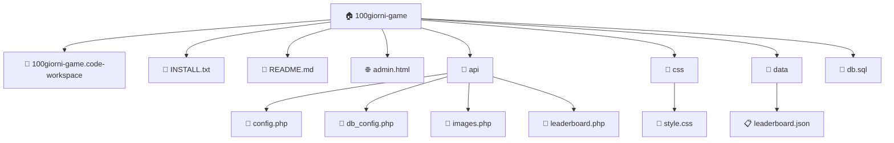

# Copilot Instructions

## Project Context
- **Type:** Generic
- **Language:** Unknown
- **Root:** 100giorni-game

## Project Structure
```
100giorni-game/
├── 100giorni-game.code-workspace
├── INSTALL.txt
├── README.md
├── admin.html
├── api/
│   ├── config.php
│   ├── db_config.php
│   ├── images.php
│   └── leaderboard.php
├── css/
│   └── style.css
├── data/
│   └── leaderboard.json
├── db.sql
├── favicon.svg
├── index.html
├── js/
│   ├── audio.js
│   ├── config.js
│   ├── game.js
│   ├── leaderboard.js
│   └── main.js
└── progress.md
└── ... (1 more)
```

## Architecture Diagram


## Key Files
- `README.md`

## Code Style
- Follow existing code patterns in this project
- Use modern syntax and best practices
- Prefer explicit types over implicit
- Match indentation and formatting of existing code

## Rules
- Don't suggest deprecated APIs
- Keep responses concise
- When modifying code, preserve existing structure
- Suggest tests when adding new functions
