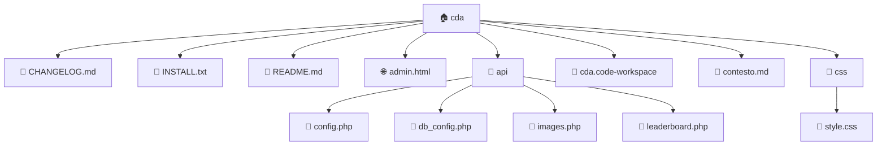

# Copilot Instructions

## Project Context
- **Type:** Generic
- **Language:** Unknown
- **Root:** cda

## Project Structure
```
cda/
├── CHANGELOG.md
├── INSTALL.txt
├── README.md
├── admin.html
├── api/
│   ├── config.php
│   ├── db_config.php
│   ├── images.php
│   └── leaderboard.php
├── cda.code-workspace
├── contesto.md
├── css/
│   └── style.css
├── data/
│   ├── config.json
│   ├── images.json
│   └── leaderboard.json
├── db.sql
├── favicon.svg
└── index.html
└── ... (7 more)
```

## Architecture Diagram


## Key Files
- `README.md`

## Code Style
- Follow existing code patterns in this project
- Use modern syntax and best practices
- Prefer explicit types over implicit
- Match indentation and formatting of existing code

## Rules
- Don't suggest deprecated APIs
- Keep responses concise
- When modifying code, preserve existing structure
- Suggest tests when adding new functions
